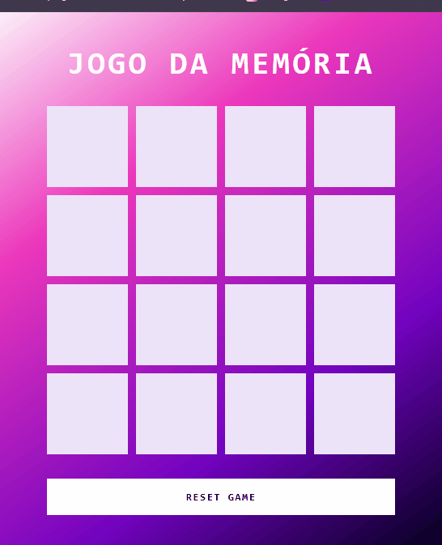

# Jogo da Memória 🧠

Bem-vindo ao projeto **Jogo da Memória**, desenvolvido com HTML, CSS e JavaScript! Este projeto foi criado como um desafio proposto pelo bootcamp **Ri Happy - Front-end do Zero** da **DIO (Digital Innovation One)**.

## 🎯 Sobre o Projeto

O **Jogo da Memória** é um jogo clássico de combinação de cartas, onde o objetivo é encontrar todos os pares correspondentes com o menor número de tentativas possível. O projeto explora conceitos fundamentais do desenvolvimento front-end, como manipulação de DOM, eventos e lógica de jogo com JavaScript.

## 🚀 Tecnologias Utilizadas

- **HTML**: Estrutura básica das páginas e componentes do jogo.
- **CSS**: Estilos para layout, animações e efeitos visuais.
- **JavaScript**: Lógica do jogo, manipulação da interface e controle de eventos.

## 🎮 Como Jogar

1. Clique em qualquer carta para revelá-la.
2. Em seguida, clique em outra carta para tentar encontrar o par correspondente.
3. Continue tentando até encontrar todos os pares!

## 📚 Funcionalidades

- **Lógica de comparação**: Verificação de pares correspondentes e ocultação de cartas quando não há combinação.
- **Contador de tentativas**: Acompanhe o número de tentativas para concluir o jogo.
- **Mensagens de feedback**: Exibição de mensagens para sucesso ao completar o jogo.

## 📸 Demonstração

## 💼 Sobre o Desafio
Este projeto foi realizado como parte do desafio proposto pelo bootcamp Ri Happy - Front-end do Zero da Digital Innovation One (DIO). A atividade envolveu a aplicação prática dos conceitos abordados nas aulas, proporcionando uma experiência prática e divertida.